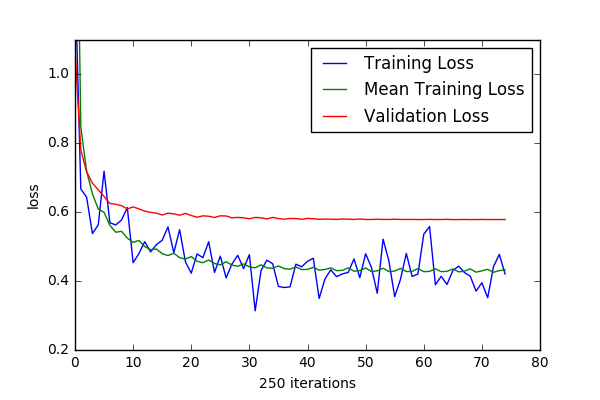
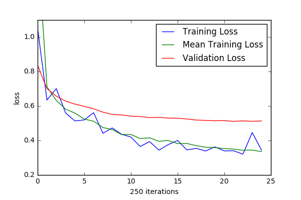
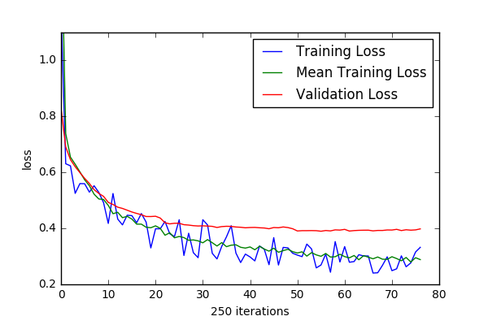
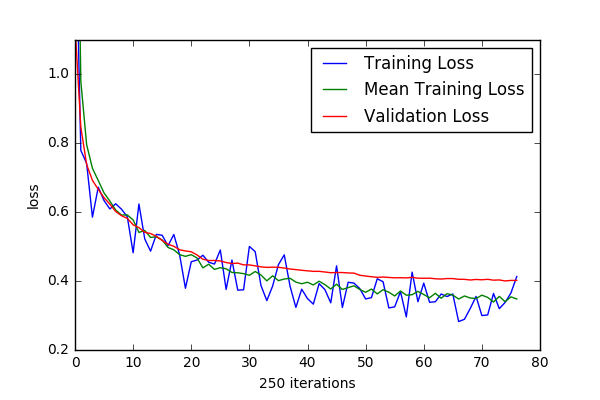
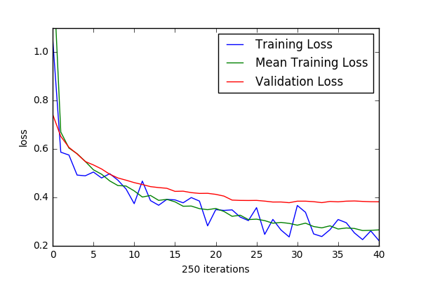

# Models

## Model 1

Trained on ~1MB `../list/files_less_than_4KB.txt` (~450 files) for 50 epochs.

```
iteration:         18700
iterations/epoch:  374
rnn size:          128
num layers:        2
batch size:        50
sequence length:   50
learning rate:     0.002000
dropout:           0.000000

checkpoint 16500 contains the minimum validation loss of 0.578616
minimum mean training loss is 0.425683
```



## Model 2

Trained on ~2.9MB `../list/files_less_than_6KB.txt` (~800 files). Also bumped rnn size to 256.

```
iteration:         6250
rnn size:          256
num layers:        2
batch size:        50
sequence length:   100
learning rate:     0.002000
dropout:           0.000000

checkpoint 5500 contains the minimum validation loss of 0.511403
minimum mean training loss is 0.335823
training/validation difference: -0.175580
```



Files generated with model #2 seemed to require significantly less
editing for eeschema to parse them correctly. ~1/3rd of the generated
files needed no alteration.

This model does, however, seem to exhibit issues related to $Comp and $Sheet. Often the model will generate text that begins a new componenet and then mid-way through defining its contents switches to defining a sheet, ending with $EndSheet and vv.  

## Model 3

Trained on all files less than 10KB (~8.3MB) and saw a huge loss drop (from `0.511` to `0.38`)

```
iteration:         19250
rnn size:          256
num layers:        2
batch size:        50
sequence length:   100
learning rate:     0.002000
dropout:           0.000000

checkpoint 14000 contains the minimum validation loss of 0.389882
minimum mean training loss is 0.279987
training/validation difference: -0.109896
```



## Model 4

Decreased learning rate from `0.002` to `0.0008` and saw a generally higher loss (as well as slower convergence).

```

iteration:         19250
rnn size:          256
num layers:        2
batch size:        50
sequence length:   100
learning rate:     0.000800
dropout:           0.000000

checkpoint 18750 contains the minimum validation loss of 0.400475
minimum mean training loss is 0.339424
training/validation difference: -0.061052
```



## Model 5 

Returned learning rate to `0.002` and increased rnn layer size from `256` to `512`. This provided a slight drop in loss (from `0.389` in model \#3 to `0.378`).
NOTE: did not train this model for too many epochs.

```
iteration:         10250
rnn size:          512
num layers:        2
batch size:        50
sequence length:   100
learning rate:     0.002000
dropout:           0.000000

checkpoint 7500 contains the minimum validation loss of 0.378453
minimum mean training loss is 0.263410
training/validation difference: -0.115043
```

